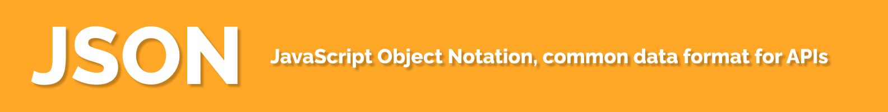

# JSON, JavaScript Object Notation

is a common data format used in many programming languages to exchange data in APIs.

JSON looks like this:

```json
{
  "Title": "Friday the 13th",
  "Year": "2009",
  "Rated": "R",
  "Released": "13 Feb 2009",
  "Runtime": "97 min",
  "Genre": "Horror, Mystery, Thriller",
  "Director": "Marcus Nispel"
}
```
This way it's possible to send it to a server as a long piece of string:

`{"Title":"Friday the 13th","Year":"2009","Rated":"R","Released":"13 Feb 2009","Runtime":"97 min","Genre":"Horror, Mystery, Thriller","Director":"Marcus Nispel"}`

All the JSON data will be inside this opening and curly braces:

```json
{

}
```
In JavaScript, we can make an object by using these curly braces, it's called an object litteral.

```js
const jason = {
    name : "Jason Voorhees",
    age : 74,
    hasKilled : true,
    birthday: "June 13, 1946"
}
```
Objects are just a combination of other primitive values such as String, Numbers, and Booleans.

The main difference between JavaScript object and JSON is in the double quotes `"`.

```js
// JS Object:
const person = {
   name: "Jason Voorhees",
   age: 74,
   hasKilled: true,
   birthday: "June 13, 1946"
}

// Converted JSON
{
   "name":"Jason Voorhees",
   "age":74,
   "hasKilled":true,
   "birthday":"June 13, 1946"
}
```
JSON will wrap a quote around both the property and the value (except booleans and numbers).

## Converting Object to JSON and vice-versa


