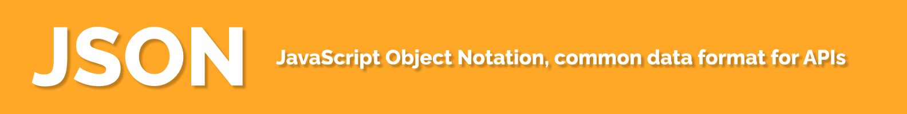

# JSON, JavaScript Object Notation

is a common data format used in many programming languages to exchange data in APIs.

JSON looks like this:

```json
{
  "Title": "Friday the 13th",
  "Year": "2009",
  "Rated": "R",
  "Released": "13 Feb 2009",
  "Runtime": "97 min",
  "Genre": "Horror, Mystery, Thriller",
  "Director": "Marcus Nispel"
}
```

This way it's possible to send it to a server as a long piece of string:

`{"Title":"Friday the 13th","Year":"2009","Rated":"R","Released":"13 Feb 2009","Runtime":"97 min","Genre":"Horror, Mystery, Thriller","Director":"Marcus Nispel"}`

All the JSON data will be inside this opening and curly braces:

```json
{}
```

In JavaScript, we can make an object by using these curly braces, it's called an object litteral.

```js
const jason = {
  name: "Jason Voorhees",
  age: 74,
  hasKilled: true,
  birthday: "June 13, 1946",
};
```

Objects are just a combination of other primitive values such as String, Numbers, and Booleans. In other languages such as Python, objects are called dictionaries.

The main difference between JavaScript object and JSON is in the double quotes `"`.

```js
// JS Object:
const person = {
   name: "Jason Voorhees",
   age: 74,
   hasKilled: true,
   birthday: "June 13, 1946"
}

// Converted JSON
{
   "name":"Jason Voorhees",
   "age":74,
   "hasKilled":true,
   "birthday":"June 13, 1946"
}
```

JSON will wrap a quote around both the property and the value (except booleans and numbers).

## Converting Object to JSON and vice-versa

You have some data in an object, you want to send it to the API. You have to convert the object into a JSON string.

JavaScript has a built in class `JSON` with a method to do this.

`JSON.stringify()` will take in an object and retrun a JSON `string`.

To do the opposite, you got some JSON back from the server and now want to access the properties, you have to convert this string into an object.

`JSON.parse()` will take a JSON string and return a JS object.

Now you can access the properties and data from it.

In every programming language, there are packages to do both of these things.

**Python example**:

```python
import json

json.loads()  # parses JSON text into a python dictionary.
json.dumps() # converts the python dictionary into JSON text.
```

**Troubleshooting**:

Most common problems with JSON comes when you want to use the JSON string data as an object without parsing it first. Or you want to send the object to the server without converting it to a JSON string first.

**Resources**:

- [json.org](https://www.json.org/json-en.html)
- [JSON w3 schools](https://www.w3schools.com/js/js_json_intro.asp)
- [Working with JSON](https://developer.mozilla.org/en-US/docs/Learn/JavaScript/Objects/JSON)

## Show some love!

If you learned something new from this repo, please star ⭐ it on GitHub. You can also tweet to share with other people.

[](https://twitter.com/intent/tweet?url=https://github.com/tamalweb/json&text=JSON%20explained%20in%20simple%20terms%20via%20@tamalweb)
